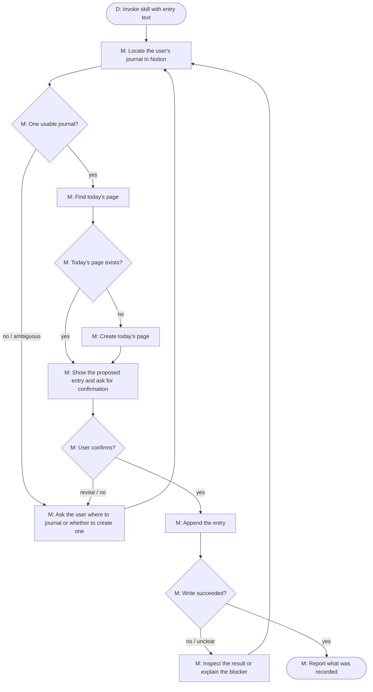

# Journaling skill loop

`journaling` is the control loop for turning a user-approved thought into an
entry in their Notion journal. The parent agent calls it with `entry_text`
once it has decided the content is journal-worthy.

## Logical loop

`D` = deterministic workflow behavior. `M` = a model-directed step inside the
scoped reasoning turn; the harness provides durable tool dispatch and user-input
waiting, but does not make the decision itself.

The loop repeats whenever the agent lacks enough information to safely proceed:
it asks the user to resolve an ambiguity, or inspects Notion again after an
unclear result. It ends when the entry was recorded and reported, or when the
agent can clearly explain why it cannot safely continue.

## Logical stages

| Stage | Intent |
|---|---|
| Locate | Use the connected Notion capability to identify exactly one journal destination. |
| Establish today’s page | Reuse today’s page if it exists; otherwise create it only after the destination is known. |
| Confirm | Let the user see and approve the actual proposed entry before it is written. |
| Write and verify | Append the entry, then use the returned evidence to decide whether the write was successful. |
| Recover or stop | If a tool result is unclear, re-inspect and continue; if required information or access is unavailable, explain the blocker rather than guessing. |

## Runtime boundary

This is the intended work loop, not a literal Temporal execution trace. The
`JournalingSkill` workflow creates a scoped reasoning turn and records its
outcome; the model decides how to use the real Notion tools at each stage. A
failure to load the initial arguments, a parent cancellation, or a loop
budget/error ends the durable invocation without pretending that the journal
entry was written.

Relevant implementation: `workflows/internal/workflow/skills/journaling.go`,
`workflows/internal/workflow/skills/support.go`,
`workflows/internal/workflow/turn.go`, and
`workflows/internal/workflow/user_input.go`.
