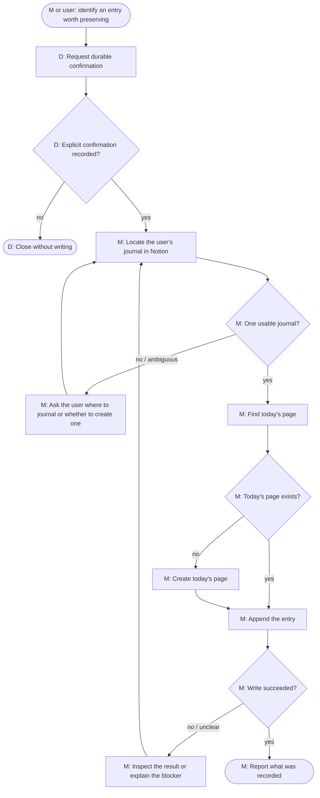

# Journaling skill loop

`journaling` is the control loop for turning a thought the agent judges worth
preserving into an entry in the user's Notion journal. The user can explicitly
ask to journal something, or the agent can invoke the skill implicitly; either
way, the skill obtains confirmation before writing.

## Logical loop

`D` = deterministic workflow behavior. `M` = a model-directed step inside the
scoped reasoning turn. The confirmation wait is durable and deterministic; the
human, rather than the model, supplies the approval.

The loop repeats whenever the agent lacks enough information to safely proceed:
it asks the user to resolve an ambiguity, or inspects Notion again after an
unclear result. It ends when the entry was recorded and reported, or when the
agent can clearly explain why it cannot safely continue.

## Logical stages

| Stage | Intent |
|---|---|
| Locate | Use the connected Notion capability to identify exactly one page titled `My Diary`, the diary root. |
| Establish today’s page | Reuse the `YYYY-MM-DD` child page for the user’s current local date, or create it beneath `My Diary` if it does not exist. |
| Confirm | Let the user see and approve the actual proposed entry before it is written. |
| Write and verify | Append the entry, then use the returned evidence to decide whether the write was successful. |
| Recover or stop | If a tool result is unclear, re-inspect and continue; if required information or access is unavailable, explain the blocker rather than guessing. |

## Runtime boundary

This is the intended work loop, not a literal Temporal execution trace. The
first native state is already implemented: `JournalingSkill` requests and
waits for durable confirmation itself. After approval, the current
implementation still uses a scoped reasoning bridge for dynamic Notion
discovery and interpretation. That bridge is being replaced state-by-state by
native capability and model-decision primitives; a failure, parent
cancellation, or loop budget/error never pretends that the journal entry was
written.

Relevant implementation: `workflows/internal/workflow/skills/journaling.go`,
`workflows/internal/workflow/skills/support.go`,
`workflows/internal/workflow/turn.go`, and
`workflows/internal/workflow/user_input.go`.
