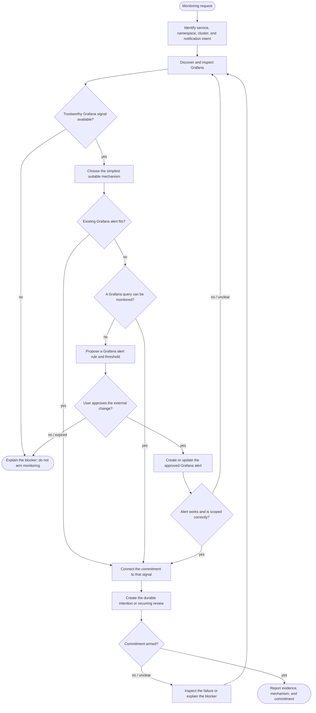

# Service monitoring skill loop

`service_monitoring` is the control loop for configuring a monitoring
commitment for one Kubernetes service. Grafana is mandatory as the evidence
source: a Kubernetes, Prometheus, or other tool cannot substitute for a
Grafana-derived signal.

## Logical loop

The main cycle is **inspect Grafana → make a decision from real evidence →
verify → inspect again when necessary**. It is intentionally not a generic
“look at every available observability system” loop: Grafana is required. The
flow stops rather than substituting another source when Grafana cannot
establish a trustworthy signal.

## Logical stages

| Stage | Intent |
|---|---|
| Scope the target | Establish the service, namespace, cluster, and the condition that should notify the user. |
| Gather evidence | Use Grafana to find the service’s actual telemetry, dashboards, queries, and existing alerts. |
| Select a mechanism | Reuse a fitting alert when possible; otherwise monitor a concrete query; create an alert rule only when neither is sufficient. |
| Obtain approval | Before a change to Grafana alerting configuration, show the proposed signal and threshold and wait for explicit approval. |
| Provision and verify | Apply only the approved change, then confirm that its target and behavior match the request. |
| Arm the commitment | Turn the selected Grafana signal into the generic durable intention or an explicit recurring review. |
| Recover or stop | Return to Grafana on ambiguous evidence or a failed verification; stop with a clear blocker when no safe path exists. |

## Relationship to an intention

The service-monitoring skill is the **setup/control loop**. It investigates
Grafana and, only after the chosen mechanism is known, creates the durable
monitoring commitment. The intention is not this workflow: it is a separate
`IntentionWorkflow` execution, or a Temporal Schedule that launches time
intentions for recurring schedules.

This is the intended work loop, not a literal Temporal execution trace. The
`ServiceMonitoringSkill` workflow validates the service name, creates the
scoped reasoning turn, and records its outcome; the model performs the
evidence-driven decisions inside the loop. The current implementation can
author a Grafana-backed polling intention or explicit recurring review, but it
does not yet turn an arbitrary Grafana alert webhook into a push-triggered
intention. That would be an extension to the generic intention trigger path.

Relevant implementation: `workflows/internal/workflow/skills/service_monitoring.go`,
`workflows/internal/workflow/skills/support.go`,
`workflows/internal/workflow/turn.go`,
`activities/activities/tools_intention.py`, and
`workflows/internal/workflow/intention.go`.
